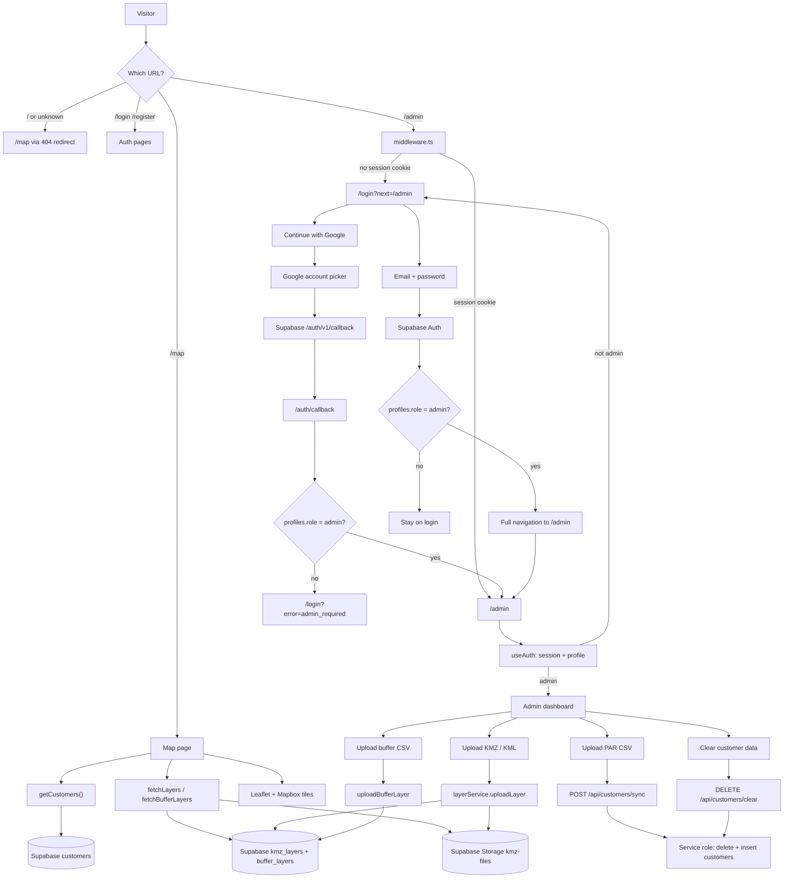
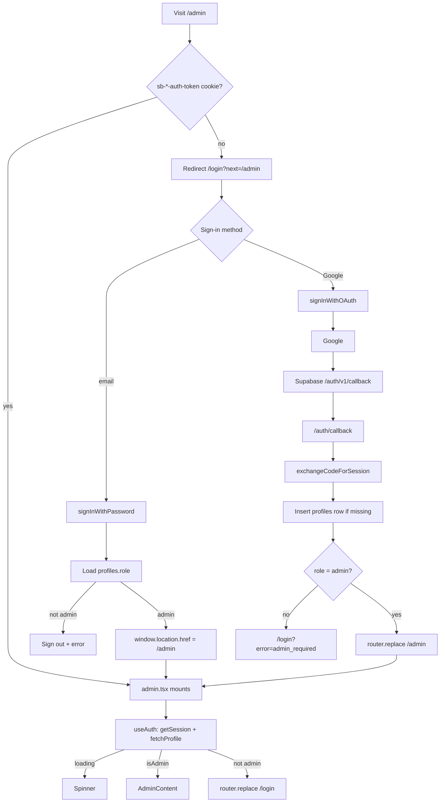
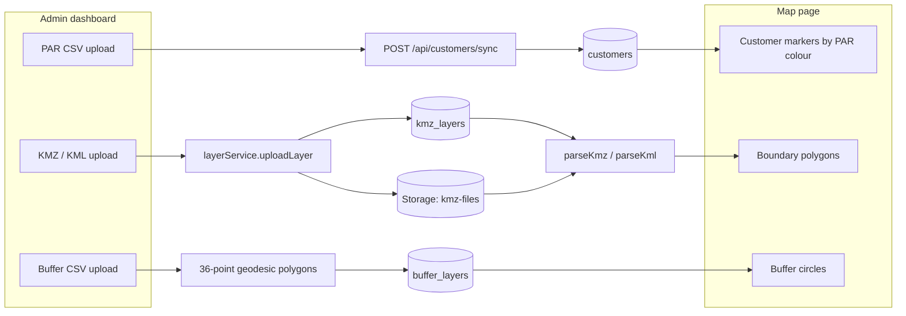

# PAR Map — Architecture

## Overview

PAR Map is a Next.js 15 app for ECS Fintech Lusaka field teams.
It visualises weekly loan portfolio data on an interactive Mapbox map of Lusaka,
with persistent boundary layers stored in Supabase and an admin dashboard
protected by Supabase Auth (email/password + Google OAuth).

---

## System flowchart

How a request moves through the app: public map, sign-in, admin tools, and the services they call.



---

## Pages

| Route | Access | Purpose |
|---|---|---|
| `/` | Public | Main map dashboard |
| `/login` | Public | Email + Google sign-in |
| `/register` | Public | Self-registration |
| `/admin` | Admin only | Layer and data management |
| `/auth/callback` | Internal | OAuth redirect handler |
| `/forgot-password` | Public | Password reset |

---

## Component Tree

```
App
├── middleware.ts                   → Edge middleware — session cookie check → /admin guard
├── pages/
│   ├── index.tsx                   → Map page (public)
│   ├── login.tsx                   → Sign-in page
│   ├── register.tsx                → Registration page
│   ├── admin.tsx                   → Admin dashboard (admin role required)
│   ├── auth/callback.tsx           → OAuth callback — profile upsert + redirect
│   ├── forgot-password.tsx         → Password reset
│   └── api/userauth.ts             → Server-side auth route
├── components/
│   ├── Map.tsx                     → Leaflet map (ssr:false)
│   ├── NavIcons.tsx                → Navbar icon components
│   └── icons.tsx                   → Shared icon library
├── lib/
│   ├── supabase.ts                 → createClient + getSupabaseAdmin() + Profile type
│   ├── useAuth.ts                  → Hook: user, profile, isAdmin, loading, signOut
│   └── layerService.ts             → fetchLayers, uploadLayer, deleteLayer,
│                                      toggleLayerVisibility, updateLayerColor, renameLayer
├── types/
│   └── par.ts                      → Customer, KMZLayer, PAR helpers, computeStats
├── utils/
│   └── kmzParser.ts                → JSZip + DOMParser: KMZ/KML File → GeoJSON
└── data/
    └── customers.ts                → Weekly PAR data — replaced each week
```

---

## Authentication Flow



Google never redirects to Next.js directly. It hits Supabase (`https://<project-ref>.supabase.co/auth/v1/callback`), then Supabase forwards to the allow-listed app URL (`https://par-map.vercel.app/auth/callback`).

### useAuth Race Condition Fix

`onAuthStateChange` fires immediately on mount with the current session,
which races with `getSession()`. Fixed with an `initialized` ref:

```typescript
// Subscribe first
const { data: { subscription } } = supabase.auth.onAuthStateChange(
  async (_event, session) => {
    if (!initialized.current) return  // skip the initial duplicate event
    // handle subsequent auth changes
  }
)

// Then resolve initial session — only this path sets loading=false
supabase.auth.getSession().then(async ({ data: { session } }) => {
  initialized.current = true
  // fetch profile, then setLoading(false)
})
```

---

## Data Flow



### KMZ Boundaries

Admin uploads a KMZ in **Boundary Layers**. `layerService.uploadLayer()` stores the file in the `kmz-files` bucket and inserts a `kmz_layers` row. The map fetches those rows, downloads the file, parses it to GeoJSON, and draws Leaflet polygons. Locked layers are hidden from the public toggle list.

### Weekly Customer Data

A data analyst exports PAR CSV from the loan system and uploads it in **Customer Data**. The app maps CSV headers to table columns (`contract_reference`, `customer`, `contact_number`, …) and `POST /api/customers/sync` replaces the `customers` table. The map reads that table and colours dots by PAR status; `PAR 90+` is treated as a priority visit.

### Buffer Circles

Admin uploads a CSV of Name / Latitude / Longitude. The app builds a 36-point geodesic polygon per point, stores it as a buffer layer, and draws it on the map next to KMZ boundaries.

---

## Middleware

`middleware.ts` runs at the Edge before every matched request.
It reads the Supabase session cookie directly — no async DB call.

```
Cookie name: sb-<PROJECT_REF>-auth-token
PROJECT_REF: extracted from NEXT_PUBLIC_SUPABASE_URL at build time

Matched routes: /admin/:path*, /login, /register

Rules:
  /admin  + no cookie → redirect to /login?next=/admin
  /login  + cookie    → redirect to /
  /register + cookie  → redirect to /
```

Full role enforcement (admin vs user) happens inside `admin.tsx` via `useAuth()`,
not in the middleware. The middleware only checks session existence.

---

## Supabase Schema

### `profiles` table

| Column | Type | Notes |
|---|---|---|
| id | uuid | FK → auth.users.id |
| full_name | text | nullable |
| role | text | 'admin' or 'user' |
| avatar_url | text | nullable |

Auto-created by trigger on `auth.users` insert.

### `kmz_layers` table

| Column | Type | Notes |
|---|---|---|
| id | uuid | PK |
| name | text | Display name |
| color | text | Hex color |
| locked | boolean | If true, public users cannot toggle |
| visible | boolean | Default visibility |
| file_path | text | Supabase Storage path |
| created_at | timestamptz | Auto |

### Storage

Bucket: `kmz-files` (Public read, authenticated write)

---

## Key Technical Decisions

| Decision | Choice | Reason |
|---|---|---|
| No SSR on map | `dynamic(import, { ssr: false })` | Leaflet uses `window` — breaks on server |
| Cookie-based middleware | Direct cookie read | No async round-trip in Edge runtime |
| Lazy admin client | `getSupabaseAdmin()` function | `SUPABASE_SERVICE_ROLE_KEY` is server-only — crashes browser if imported eagerly |
| Session polling removed | `getSession()` single call | Supabase JS holds session in memory after signIn — polling was redundant |
| Full navigation on login | `window.location.href` | Ensures session cookie is present before middleware runs on /admin |
| Auth race fix | `initialized` ref | Prevents `onAuthStateChange` from firing before `getSession()` completes |
| KMZ in browser | JSZip + DOMParser | No upload endpoint needed for parsing |
| Tiles | Mapbox | Better quality than OSM for Lusaka |

---

## Deployment

- **Host:** Vercel
- **Trigger:** Push to `main` branch
- **Build:** `next build`
- **Env vars:** Set all four variables in Vercel → Project → Environment Variables
- **Update cycle:** Weekly — analyst updates `customers.ts` and pushes

## Constraints

- Must load fast on mobile in Lusaka (low bandwidth)
- Leaflet must never be imported at the top level of any page
- `.env.local` is gitignored — never commit real keys
- `SUPABASE_SERVICE_ROLE_KEY` must never be used in browser code